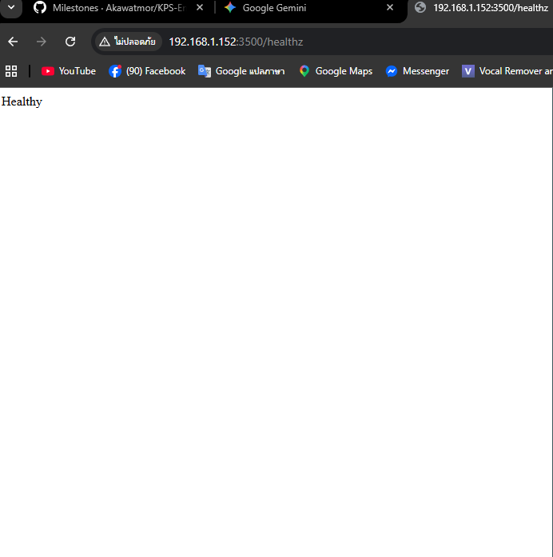
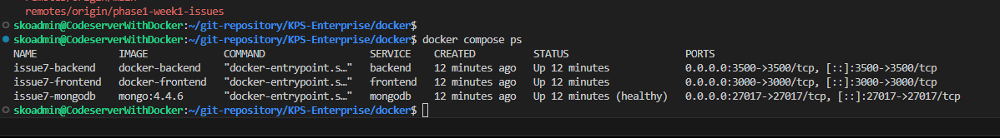
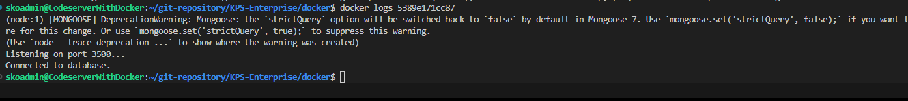

# Issue #7 Local Docker Test Report

**Issue:** Run application locally with Docker Compose for verification  
**Branch:** `issue7-test-result`  
**Test Folder:** `docker/`  
**Status:** Completed locally

## What was prepared

I copied the runtime requirements into the `docker/` folder so the local test is self-contained:

- `docker/backend/`
- `docker/frontend/`
- `docker/docker-compose.yml`

The copied backend/frontend folders were used for the local Docker test.  
The compose file starts:

- MongoDB
- Backend API
- Frontend UI

## Local Docker run

Command used:

```bash
cd docker
docker compose up -d --build
```

## Service status

`docker compose ps` showed all three services up:

```text
NAME              IMAGE             COMMAND                  SERVICE    CREATED              STATUS                    PORTS
issue7-backend    docker-backend    "docker-entrypoint.s…"   backend    Up 47 seconds        0.0.0.0:3500->3500/tcp
issue7-frontend   docker-frontend   "docker-entrypoint.s…"   frontend   Up 46 seconds        0.0.0.0:3000->3000/tcp
issue7-mongodb    mongo:4.4.6       "docker-entrypoint.s…"   mongodb    Up 52 seconds        Up (healthy)             0.0.0.0:27017->27017/tcp
```

## Backend verification

Backend logs confirmed the API started and connected to MongoDB:

```text
Listening on port 3500...
Connected to database.
Database readyState: 1
```

Health checks returned:

- `GET /healthz` → `200 Healthy`
- `GET /ready` → `200 Ready`

## CRUD verification

I ran the full task flow against the backend API.

### Initial read

`GET /api/tasks` returned:

```json
[]
```

### Create

`POST /api/tasks` with:

```json
{"task":"Issue 7 local docker test","completed":false}
```

Response:

```json
{"task":"Issue 7 local docker test","completed":false,"_id":"69c616a2e90bbab7b0b838ce","__v":0}
```

### Read after create

`GET /api/tasks` returned 1 task with the created ID.

### Update

`PUT /api/tasks/69c616a2e90bbab7b0b838ce` with:

```json
{"completed":true}
```

After the update, `GET /api/tasks` showed:

```json
[{"_id":"69c616a2e90bbab7b0b838ce","task":"Issue 7 local docker test","completed":true,"__v":0}]
```

### Delete

`DELETE /api/tasks/69c616a2e90bbab7b0b838ce` succeeded, and the final `GET /api/tasks` returned:

```json
[]
```

## Frontend verification

Frontend logs showed the React app compiled successfully:

```text
Compiled successfully!
You can now view the client in the browser.
Local:            http://localhost:3000
```

`GET http://localhost:3000` returned the React app HTML, confirming the frontend was reachable from the host browser.

## Fixes made for the local Docker copy

Two small local-only fixes were needed in the `docker/` copy:

- `docker/frontend/package.json`: corrected the axios version string to `^0.30.0`
- `docker/backend/db.js`: made `USE_DB_AUTH` parse as a real boolean

These changes were applied only to the Docker test copy so the local stack could build and run cleanly.

## Notes

- MongoDB image: `mongo:4.4.6`
- Backend port: `3500`
- Frontend port: `3000`
- MongoDB port: `27017`
- A non-blocking Mongoose deprecation warning appeared in the backend log, but it did not affect the test

## Screenshot capture place

Please place the screenshots in the following spots when you capture them:

- Frontend browser view:


- Docker compose status: `document/phase1/screenshots/issue7/`

- Backend log output: 


## Summary

Issue #7 was verified locally with Docker:

- MongoDB started successfully
- Backend connected to MongoDB successfully
- Frontend started successfully
- CRUD operations worked end-to-end
- The local Docker test is ready for your final review
