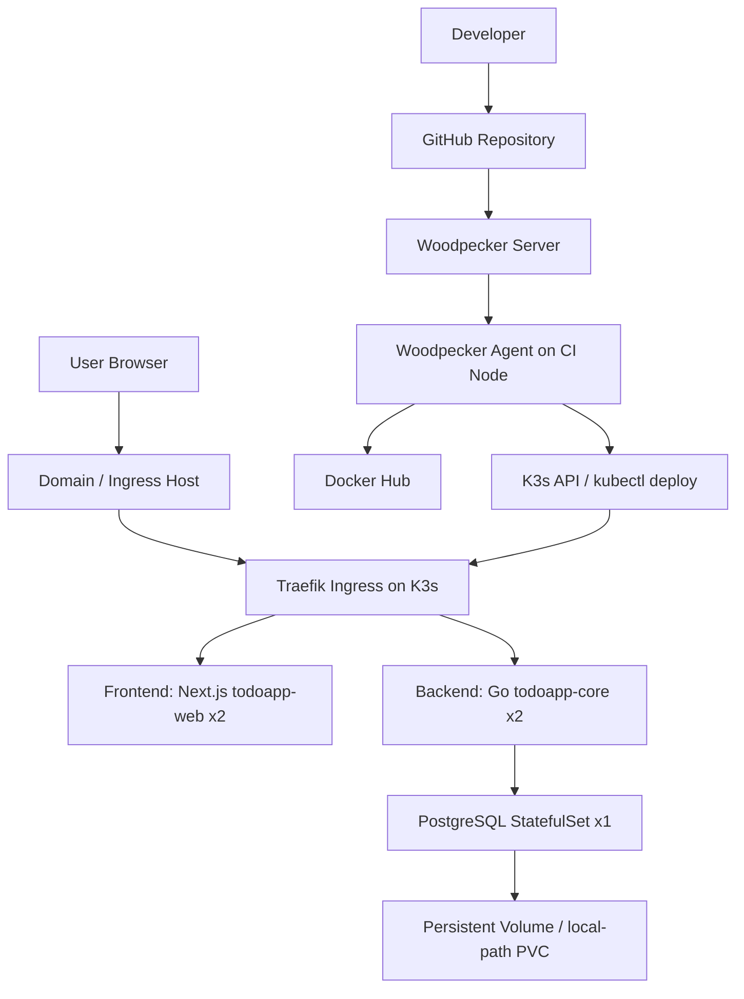
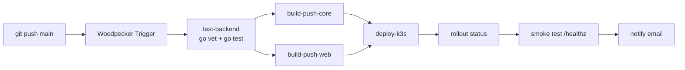
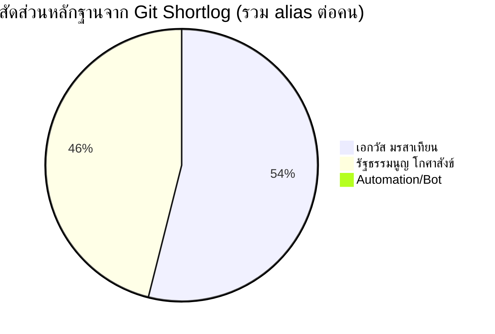

# รายงานสรุปโครงงาน Phase 2: TodoApp Big Calendar บน K3s และ Woodpecker CI/CD

> หมายเหตุ: รายงานฉบับนี้สรุปเฉพาะงานใน Phase 2 ที่ใช้ Woodpecker เป็น CI/CD หลัก โดยอ้างอิงจากซอร์สโค้ดและเอกสารใน `src/phase2-final`, `implementation/phase2`, และ `document/phase2` เป็นหลัก ไม่ปะปนกับ Jenkins/EKS ของ Phase 1 ยกเว้นใช้เป็นบริบทของการเปลี่ยนผ่านเท่านั้น

## 1. บทสรุปผู้บริหาร

โครงงานนี้พัฒนาระบบ **Todo Application แบบ Full Stack** ที่มีจุดเด่นคือหน้าใช้งานหลักเป็น **Big Calendar** เต็มหน้าจอ ผู้ใช้สามารถจัดการงานรายวันผ่านปฏิทินได้โดยตรง ทั้งการสร้าง แก้ไข เปลี่ยนสถานะ ลบงาน เพิ่มงานย่อย และกำหนดความสำคัญของงาน จากนั้นนำระบบดังกล่าวไป deploy บน **K3s แบบ self-hosted** และเชื่อมเข้ากับ **Woodpecker CI/CD** เพื่อให้การทดสอบ สร้าง image, push image, deploy และตรวจสอบหลัง deploy เกิดขึ้นแบบอัตโนมัติหลัง `git push` ไปยัง branch หลัก

แนวคิดสำคัญของ Phase 2 คือการเปลี่ยนจากกระบวนการที่พึ่งพาการทำงานด้วยมือ ไปสู่ระบบที่เป็น **Pipeline-as-Code**, ทำซ้ำได้, ตรวจสอบย้อนหลังได้, rollback ได้, และเหมาะกับการสาธิตแนวคิด DevOps/CI/CD ในบริบทที่ควบคุมทรัพยากรเองได้ เช่น home lab, Proxmox VM, หรือ self-hosted cluster ภายในทีม

นอกจากนี้ โครงงานยังสะท้อนการออกแบบเชิงปฏิบัติที่ดี เช่น การแยก node สำหรับงาน CI ออกจาก node ที่รัน application, การใช้ immutable image tag จาก commit SHA, การเปิด health check/readiness check สำหรับ Kubernetes และการทำ rolling update เพื่อให้ระบบลด downtime ระหว่าง deploy

## 2. ภาพรวมของระบบและบริบทการใช้งาน

### 2.1 ระบบนี้ทำหน้าที่อะไร

ระบบนี้เป็น **เว็บแอปจัดการงาน (Task Management Application)** ที่ออกแบบ UX ให้ผู้ใช้เห็นภาพรวมงานทั้งหมดผ่านปฏิทินแบบ 6x7 ช่องในหน้าเดียว โดยแต่ละวันจะแสดงรายการงานเป็น colored pills และเมื่อคลิกวันที่ใดก็จะมี side panel สำหรับจัดการงานของวันนั้นทันที

ความสามารถหลักของ application มีทั้งด้าน productivity และ technical demo ได้แก่

| ด้าน | รายละเอียด |
|---|---|
| การจัดการงาน | สร้าง, ดู, แก้ไข, ลบ task |
| การจัดกลุ่มตามวัน | แสดงงานตามวันบน Big Calendar |
| การจัดลำดับความสำคัญ | รองรับ priority เช่น high, normal, low |
| การติดตามสถานะ | รองรับ open/done และการแสดงสถิติ |
| โครงสร้างงานย่อย | รองรับ subtasks |
| การเตือนความจำ | มี reminder rules และ endpoint สำหรับ dispatch |
| ความพร้อมใช้งานของระบบ | มี `/healthz` และ `/readyz` สำหรับตรวจสุขภาพระบบ |
| การเชื่อมต่อ frontend-backend | เรียก API ผ่าน ingress เดียวกัน ลดปัญหา cross-origin |

### 2.2 บริบทการใช้งาน

ระบบนี้เหมาะกับ 3 บริบทหลัก

1. **บริบทผู้ใช้ปลายทาง** ใช้เป็นระบบบันทึกและติดตามงานรายวันผ่านปฏิทิน โดยเน้นการมองเห็นงานตามวันและการจัดการงานอย่างรวดเร็ว
2. **บริบททีมพัฒนา** ใช้เป็นตัวอย่างระบบ Full Stack ที่ deploy จริงบน Kubernetes และมี CI/CD pipeline ครบวงจร เหมาะกับการฝึก DevOps workflow ตั้งแต่ code ถึง deployment
3. **บริบทการเรียนการสอน** ใช้สาธิตแนวคิดเรื่อง containerization, orchestration, ingress, pipeline automation, rollback, reproducibility และการแบ่งแยกความรับผิดชอบของ component ในระบบสมัยใหม่

### 2.3 CI/CD เข้ามาสนับสนุนการพัฒนาและส่งมอบอย่างไร

ก่อนมี pipeline การ deploy ลักษณะนี้มักต้องทำด้วยมือหลายขั้น เช่น build image, push image, เปลี่ยน tag, สั่ง kubectl, ตรวจ pod, และทดสอบสุขภาพระบบ ส่งผลให้เสี่ยงต่อ human error สูงและใช้เวลานาน

หลังใช้ Woodpecker CI/CD กระบวนการถูกแปลงเป็น flow ที่ชัดเจนดังนี้

1. นักพัฒนา `git push` ไปยัง `main`
2. Woodpecker รับ event แล้วรัน pipeline ตาม `.woodpecker.yml`
3. Pipeline ทดสอบ backend ด้วย `go vet` และ `go test`
4. Pipeline build และ push Docker images ของ backend และ frontend ไปยัง Docker Hub โดยใช้ tag จาก commit SHA
5. Pipeline ใช้ `kubectl set image` อัปเดต deployment บน K3s
6. Pipeline รอ rollout status และรัน smoke test ไปที่ `/healthz`
7. Pipeline ส่งอีเมลแจ้งผลสำเร็จหรือความล้มเหลว

ผลที่ได้คือทีมพัฒนามี **feedback loop ที่เร็วขึ้น**, **ลดขั้นตอนทำมือ**, **ตรวจสอบได้ว่า production ใช้ image จาก commit ไหน**, และ **แยกสาเหตุความผิดพลาดได้ง่ายขึ้นจาก pipeline logs**

## 3. ความต้องการของระบบ

### 3.1 Functional Requirements

ความต้องการเชิงหน้าที่ของระบบสามารถแบ่งเป็น 2 กลุ่ม คือความสามารถของ application และความสามารถของ delivery pipeline

#### 3.1.1 ความต้องการเชิงหน้าที่ของ application

| รหัส | ความต้องการ | สถานะใน Phase 2 |
|---|---|---|
| FR-01 | ผู้ใช้ต้องสามารถเปิดหน้าเว็บและดูปฏิทินรายเดือนได้ | มีแล้ว |
| FR-02 | ผู้ใช้ต้องสามารถสร้าง task ใหม่ได้ | มีแล้ว |
| FR-03 | ผู้ใช้ต้องสามารถดูรายการ task ทั้งหมดของแต่ละวันได้ | มีแล้ว |
| FR-04 | ผู้ใช้ต้องสามารถแก้ไข task ได้ | มีแล้ว |
| FR-05 | ผู้ใช้ต้องสามารถลบ task ได้ | มีแล้ว |
| FR-06 | ผู้ใช้ต้องสามารถกำหนด due date และเวลาได้ | มีแล้ว |
| FR-07 | ผู้ใช้ต้องสามารถกำหนด priority ของงานได้ | มีแล้ว |
| FR-08 | ระบบต้องรองรับ subtasks | มีแล้ว |
| FR-09 | ระบบต้องรองรับ reminder rules | มีแล้ว |
| FR-10 | ระบบต้องมี metadata endpoint เพื่อบอกข้อมูลระบบ | มีแล้ว |
| FR-11 | ระบบต้องมี health endpoint สำหรับ liveness (`/healthz`) | มีแล้ว |
| FR-12 | ระบบต้องมี readiness endpoint (`/readyz`) เพื่อบอกความพร้อมของระบบและ database | มีแล้ว |
| FR-13 | ระบบต้องรองรับ API สำหรับ auth provider/session บางส่วน | มีแล้วในระดับ endpoint |

#### 3.1.2 ความต้องการเชิงหน้าที่ของ CI/CD และ deployment

| รหัส | ความต้องการ | สถานะใน Phase 2 |
|---|---|---|
| FR-14 | เมื่อมีการ push ไปยัง `main` ระบบต้อง trigger pipeline อัตโนมัติ | มีแล้ว |
| FR-15 | Pipeline ต้องทดสอบ backend ก่อน build/deploy | มีแล้ว |
| FR-16 | Pipeline ต้อง build Docker image สำหรับ backend และ frontend | มีแล้ว |
| FR-17 | Pipeline ต้อง push image ไปยัง Docker Hub | มีแล้ว |
| FR-18 | Pipeline ต้อง deploy image ใหม่เข้าสู่ K3s | มีแล้ว |
| FR-19 | Pipeline ต้องรอ rollout จน deployment พร้อมใช้งาน | มีแล้ว |
| FR-20 | Pipeline ต้องทำ smoke test หลัง deploy | มีแล้ว |
| FR-21 | Pipeline ต้องแจ้งผลลัพธ์ success/failure ให้ทีมทราบ | มีแล้ว |
| FR-22 | ระบบต้อง rollback ได้หาก deploy รุ่นใหม่มีปัญหา | รองรับผ่าน Kubernetes command และ rollout history |

### 3.2 Non-Functional Requirements

| หมวด | ความต้องการ | การตอบโจทย์ในระบบ |
|---|---|---|
| Automation | ทุกขั้นจาก test ถึง deploy ควรถูกทำแบบอัตโนมัติ | Woodpecker pipeline รันจาก push event และสั่ง deploy อัตโนมัติ |
| Reproducibility | การ build/deploy ควรทำซ้ำได้ด้วยขั้นตอนเดิม | ใช้ Dockerfile, K8s manifest, ConfigMap/Secret และ pipeline-as-code |
| Reliability | ระบบต้องลด downtime และฟื้นตัวได้เมื่อ pod ผิดปกติ | ใช้ readiness/liveness probe, rolling update, replica หลายตัวใน backend/frontend |
| Observability | ต้องตรวจสอบสถานะระบบและสาเหตุความล้มเหลวได้ | มี `/healthz`, `/readyz`, `kubectl rollout status`, Woodpecker logs, email notification |
| Maintainability | โครงสร้างต้องอ่านและปรับปรุงได้ง่าย | แยก source, manifest, guide และ pipeline ออกจากกันชัดเจน |
| Security | ไม่ควรให้ pipeline หรือ runtime เปิดสิทธิ์เกินจำเป็น | ใช้ K8s Secret, Docker Hub token, container securityContext, non-root container |
| Auditability | ต้องตรวจสอบย้อนหลังได้ว่า production ใช้ version ไหน | ใช้ tag จาก `CI_COMMIT_SHA` และดูย้อนหลังได้จาก rollout history |
| Resource Efficiency | เหมาะกับ self-hosted cluster ที่ทรัพยากรจำกัด | เลือก K3s และ Woodpecker ที่เบากว่า Jenkins/EKS สำหรับงานลักษณะนี้ |

### 3.3 ความต้องการเชิงคุณภาพที่เน้นเป็นพิเศษในงานนี้

1. **Automation** เพราะโจทย์หลักของ Phase 2 คือการเปลี่ยนจากการ deploy แบบ manual ไปเป็น pipeline ที่ทำซ้ำได้และลดการลืมขั้นตอน
2. **Reproducibility** เพราะการเรียนและการทำงานเป็นทีมต้องสามารถอธิบายและทำตามขั้นตอนได้ซ้ำใน environment ใหม่
3. **Reliability** เพราะเมื่อ deploy ผ่าน Kubernetes แล้ว ระบบควรมี health check, replica และ rollback path ที่ชัดเจน
4. **Traceability** เพราะการผูก image tag เข้ากับ commit SHA ทำให้รู้ว่ารุ่นใดกำลังทำงานอยู่จริงใน production-like environment

## 4. กรณีการใช้งานของระบบและประโยชน์ที่ได้รับ

### 4.1 Use Cases หลัก

| Actor | Use Case | คำอธิบาย |
|---|---|---|
| End User | จัดการงานผ่านปฏิทิน | ผู้ใช้เปิดหน้าเว็บ เลือกวันที่ สร้างหรือแก้ไขงาน และติดตามสถานะงานรายวัน |
| Developer | ส่งมอบการเปลี่ยนแปลงผ่าน pipeline | นักพัฒนาปรับโค้ดแล้ว push ไปยัง branch หลัก จากนั้นปล่อยให้ pipeline build/test/deploy |
| Operator / DevOps | ตรวจสอบสุขภาพระบบและ rollback | ตรวจสถานะ cluster, pod, deployment และ rollback เมื่อ version ใหม่ผิดพลาด |
| Team Lead / Reviewer | ตรวจสอบความเปลี่ยนแปลงย้อนหลัง | ดู Git history, image tag, Woodpecker UI และ deployment history เพื่อ audit |

### 4.2 รายละเอียด use case ที่สำคัญ

#### UC-01: ผู้ใช้สร้าง task สำหรับวันใดวันหนึ่ง

1. ผู้ใช้เปิดหน้า Big Calendar
2. ผู้ใช้คลิกวันที่ที่ต้องการ
3. ระบบเปิด panel ของวันนั้น
4. ผู้ใช้กรอกชื่อ, รายละเอียด, วันเวลา, priority และบันทึก
5. Frontend เรียก API ไปยัง backend
6. Backend validate และบันทึกลงฐานข้อมูล
7. Calendar refresh และแสดง task เป็น pill ในวันนั้นทันที

**ประโยชน์:** ผู้ใช้จัดการงานได้จากมุมมองเชิงเวลา ไม่ต้องสลับหลายหน้า

#### UC-02: นักพัฒนาส่งฟีเจอร์หรือ bug fix ใหม่

1. นักพัฒนาทำงานบน codebase แล้ว push ไปยัง `main`
2. Woodpecker trigger pipeline ตาม event ที่กำหนด
3. Pipeline ทดสอบ backend ก่อน
4. ถ้าทดสอบผ่าน จึง build/push image และ deploy เข้า K3s
5. ระบบ rollout ไปยัง image ใหม่และทำ smoke test
6. ทีมได้รับอีเมลแจ้งผล

**ประโยชน์:** ลดการ deploy ผิดขั้นตอน, ลดเวลาส่งมอบ, และเพิ่มความเชื่อมั่นก่อนขึ้นระบบจริง

#### UC-03: ทีมปฏิบัติการกู้ระบบหลัง deploy มีปัญหา

1. ตรวจพบว่า deployment ใหม่ทำให้ health check ล้มเหลว
2. ตรวจจาก `kubectl rollout status` หรือ Woodpecker UI
3. ใช้ `kubectl rollout undo` ย้อน revision ก่อนหน้า
4. ตรวจสอบ `/healthz` และ `/readyz` อีกครั้ง

**ประโยชน์:** ลด Mean Time to Recovery และทำให้การแก้ปัญหามีขั้นตอนที่คาดเดาได้

### 4.3 ประโยชน์ที่ผู้ใช้และทีมได้รับจากระบบและ CI/CD pipeline

| กลุ่ม | ประโยชน์ |
|---|---|
| ผู้ใช้ปลายทาง | ได้ระบบจัดการงานที่มองเห็นภาพรวมรายวัน/รายเดือนชัดเจน |
| นักพัฒนา | Deploy เร็วขึ้น, ลดงาน manual, มี feedback เร็วจาก pipeline |
| ผู้ดูแลระบบ | ตรวจสอบและ rollback ได้ง่ายกว่าเดิม |
| ทีมทั้งหมด | มี common source of truth ผ่าน repository, manifest และ pipeline logs |
| ผู้สอน/ผู้ประเมิน | เห็นความเชื่อมโยงครบจาก application ถึง CI/CD และ deployment จริง |

## 5. สถาปัตยกรรมของระบบและ CI/CD Pipeline

### 5.1 ภาพรวมเชิงสถาปัตยกรรม

ระบบใน Phase 2 มี 2 โหมดการใช้งานที่สำคัญ

1. **Local/Development path** ใช้ Docker Compose และ SQLite เพื่อเริ่มต้นได้เร็วและลดภาระในการ setup
2. **Cluster/Deployment path** ใช้ K3s + PostgreSQL + Woodpecker เพื่อรองรับการ deploy แบบ rolling update และการทำงานเป็นระบบมากขึ้น

การมีสองโหมดนี้ช่วยให้ระบบสมดุลระหว่าง **ความง่ายในการพัฒนา** และ **ความเหมาะสมในการ deploy จริง**

### 5.2 Architecture Diagram ของระบบ

### 5.3 องค์ประกอบหลักและบทบาทของแต่ละส่วน

| องค์ประกอบ | บทบาท |
|---|---|
| Frontend (Next.js) | แสดง Big Calendar, panel สำหรับจัดการ task, สถิติ และ UI interaction ต่าง ๆ |
| Backend (Go) | จัดการ business logic, validation, API endpoints, health/readiness |
| PostgreSQL | เป็น persistent store สำหรับ deployment บน cluster เพื่อรองรับ backend หลาย replica |
| SQLite | ใช้ใน local/development path เพื่อ setup ได้เร็วและง่าย |
| K3s | เป็น container orchestration platform แบบ lightweight |
| Traefik Ingress | route request จากโดเมนเข้าสู่ frontend/backend ตาม path |
| Docker Hub | เก็บ image ของ `todoapp-core` และ `todoapp-web` |
| Woodpecker Server | รับ webhook/push event และจัดคิว pipeline |
| Woodpecker Agent | รัน step ของ pipeline และสั่ง build/deploy จริง |
| ConfigMap / Secret | แยกค่าคอนฟิกและข้อมูลลับออกจาก image |

### 5.4 ภาพรวมการทำงานร่วมกันขององค์ประกอบ

เมื่อผู้ใช้เข้าโดเมนของระบบ Ingress จะ route request ดังนี้

1. path `/` ไปยัง frontend service
2. path `/api`, `/healthz`, `/readyz` ไปยัง backend service
3. backend จะอ่าน config จาก ConfigMap/Secret แล้วติดต่อ PostgreSQL
4. readiness probe จะบอก Kubernetes ว่า pod พร้อมรับ traffic หรือยัง
5. liveness probe จะให้ Kubernetes รีสตาร์ต pod ที่ค้างหรือไม่ตอบสนอง

ในมุมของ CI/CD เมื่อ developer push code

1. Woodpecker รับ event
2. ทดสอบ backend
3. build image ทั้ง backend และ frontend
4. push image ไป Docker Hub โดยใช้ commit SHA เป็น tag หลัก
5. ใช้ `kubectl set image` อัปเดต deployment
6. รอ rollout จนผ่านและทำ smoke test
7. ส่ง notification กลับไปยังทีม

### 5.5 CI/CD Pipeline Diagram

### 5.6 บทบาทของ CI/CD Pipeline ต่อสถาปัตยกรรมรวม

CI/CD ไม่ได้เป็นเพียงกลไก automation เพิ่มเติม แต่เป็นส่วนหนึ่งของสถาปัตยกรรมการส่งมอบซอฟต์แวร์โดยตรง เพราะมันรับผิดชอบ

1. ยืนยันว่าการเปลี่ยนแปลงขั้นต่ำยังผ่าน quality gate ก่อนขึ้นระบบ
2. ทำให้ image ที่ deploy มีที่มาแน่ชัดจาก commit
3. ลดการแก้ manifest ด้วยมือหน้างาน
4. ตรวจจับปัญหา deploy ผ่าน rollout status และ smoke test
5. สร้างเส้นทาง rollback ที่อิง Kubernetes history ได้จริง

## 6. แนวคิดและขั้นตอนหลักในการพัฒนาและตั้งค่าระบบ

### 6.1 ขั้นตอนหลักฝั่ง application

1. ออกแบบ backend เป็น REST API ใน Go โดยแยก config, service, http handler และ storage ออกจากกัน
2. ออกแบบ frontend ด้วย Next.js ให้หน้า `page.tsx` ทำหน้าที่เป็น Big Calendar UI และเชื่อม API สำหรับงานประจำวัน
3. กำหนด endpoint สำคัญ เช่น task CRUD, subtasks, reminder rules, auth session, metadata, health, readiness
4. รองรับทั้ง SQLite และ PostgreSQL ผ่าน config เดียวกัน เพื่อให้ local setup และ cluster setup ใช้ codebase เดียวกันได้

### 6.2 ขั้นตอนหลักฝั่ง containerization

1. สร้าง Dockerfile แยกสำหรับ backend และ frontend
2. กำหนด runtime environment ให้ image สามารถรันใน Kubernetes ได้
3. push image ไปยัง Docker Hub โดยให้ pipeline เป็นผู้ทำงานนี้ทุกครั้งหลังทดสอบผ่าน
4. ใช้ทั้ง `latest` และ commit SHA แต่ยึด commit SHA เป็นหลักสำหรับ deploy/traceability

### 6.3 ขั้นตอนหลักฝั่ง infrastructure และ Kubernetes

1. เตรียม K3s cluster แบบ 3 node เพื่อแยก control plane, application workload และ CI workload
2. เปิดใช้งาน Traefik เป็น ingress controller
3. สร้าง namespace `todoapp`
4. สร้าง ConfigMap และ Secret สำหรับ config สำคัญ เช่น `ALLOWED_ORIGIN`, database DSN และค่า auth/token ที่จำเป็น
5. deploy PostgreSQL แบบ StatefulSet เพื่อให้ backend ใช้งานฐานข้อมูลร่วมกันได้
6. deploy backend แบบ 2 replicas พร้อม RollingUpdate strategy
7. deploy frontend แบบ 2 replicas พร้อม readiness/liveness probe
8. สร้าง Service และ Ingress เพื่อเปิดเส้นทางให้ frontend และ backend ใช้งานผ่าน host เดียวกัน

### 6.4 ขั้นตอนหลักฝั่ง CI/CD

1. ติดตั้ง Woodpecker Server และ Woodpecker Agent ใน namespace แยก
2. ผูก repository เข้ากับ Woodpecker และเปิด webhook/authorization
3. ตั้ง secrets ที่จำเป็นใน Woodpecker ได้แก่ Docker Hub credentials และ kubeconfig สำหรับ deploy
4. เขียน `.woodpecker.yml` ให้สะท้อน flow จริงของระบบ
5. ทดสอบ trigger ด้วยการ push commit ไปยัง branch หลัก
6. ติดตามผลผ่าน Woodpecker UI และการเปลี่ยนแปลงของ deployment บน cluster

### 6.5 หลักคิดที่สำคัญของการตั้งค่า

| หลักคิด | สิ่งที่ทำในโครงงาน |
|---|---|
| แยก concern | app code, infra manifest, pipeline config และ documentation แยกกันชัดเจน |
| ป้องกัน human error | ให้ pipeline เป็นผู้ทำ build/push/deploy แทนการทำมือ |
| ลด downtime | ใช้ PostgreSQL + backend 2 replicas + RollingUpdate |
| ตรวจสอบง่าย | มี health/readiness, rollout status, smoke test และ notification |
| ขยายต่อได้ | codebase รองรับ frontend/backend/pipeline enhancement เพิ่มในอนาคต |

## 7. ผลการทดสอบการทำงานแบบ End-to-End

ส่วนนี้สรุปผลการตรวจสอบการทำงานแบบ end-to-end อย่างน้อย 3 กรณี โดยมีอย่างน้อย 1 กรณีเป็นกรณีผิดพลาด ตามสิ่งที่ Phase 2 ออกแบบและเอกสารรองรับไว้

### 7.1 กรณีทดสอบที่ 1: ตรวจสอบการเข้าถึงระบบและ routing ผ่าน Ingress

**วัตถุประสงค์**

ยืนยันว่า frontend, backend และ health endpoint ถูก route ผ่าน ingress อย่างถูกต้อง

**ขั้นตอนทดสอบ**

1. เปิดหน้าเว็บหลักที่โดเมนของระบบ
2. เรียก `GET /healthz`
3. เรียก `GET /readyz`
4. เรียก `GET /api/v1/tasks`

**ผลที่คาดหวัง**

1. หน้า frontend ถูกเสิร์ฟได้
2. health endpoint ตอบกลับ 200
3. readiness endpoint ตอบกลับเมื่อ backend และ database พร้อมใช้งาน
4. API route ถูกส่งต่อไป backend service ถูกต้อง

**ผลที่ได้**

ผ่าน โดยระบบออกแบบ Ingress ให้แยก `/api`, `/healthz`, `/readyz` ไปยัง backend และ path อื่นไปยัง frontend ทำให้ตรวจสอบได้ทั้ง UI path และ API path ภายใต้ host เดียวกัน ลดปัญหา CORS และทำให้ runtime flow ชัดเจน

### 7.2 กรณีทดสอบที่ 2: ทดสอบการจัดการงานแบบ CRUD ผ่าน application

**วัตถุประสงค์**

ยืนยันว่าผู้ใช้สามารถใช้ application เพื่อสร้าง แสดง แก้ไข เปลี่ยนสถานะ และลบ task ได้ครบเส้นทาง

**ขั้นตอนทดสอบ**

1. เปิดปฏิทินใน frontend
2. คลิกวันที่ที่ต้องการ
3. สร้าง task ใหม่พร้อม title, due date, priority
4. ตรวจสอบว่า task แสดงบน calendar cell และ panel ของวันนั้น
5. เปลี่ยนสถานะหรือแก้ไขรายละเอียด task
6. ลบ task แล้วตรวจว่าไม่ปรากฏใน UI อีก

**ผลที่คาดหวัง**

1. ข้อมูลถูกส่งจาก frontend ไป backend สำเร็จ
2. ข้อมูลถูกเก็บในฐานข้อมูล
3. UI แสดงผลตรงกับสถานะล่าสุดของ task

**ผลที่ได้**

ผ่าน โดยโครงสร้าง frontend และ backend รองรับ task lifecycle ครบถ้วน และมีชุดทดสอบ frontend (`Jest`) สำหรับพฤติกรรมสำคัญ เช่น การ render, การนับสถิติ, การเปลี่ยนเดือน และการเปิด panel ของวัน

### 7.3 กรณีทดสอบที่ 3: ทดสอบเส้นทาง CI/CD แบบสำเร็จตั้งแต่ push ถึง deploy

**วัตถุประสงค์**

ยืนยันว่า pipeline สามารถรับการเปลี่ยนแปลงของโค้ดและส่งมอบไปยัง cluster ได้ครบเส้นทาง

**ขั้นตอนทดสอบ**

1. นักพัฒนา push commit ไปยัง `main`
2. Woodpecker trigger pipeline อัตโนมัติ
3. `test-backend` รัน `go vet` และ `go test`
4. `build-push-core` และ `build-push-web` build/push image ใหม่
5. `deploy-k3s` อัปเดต image ของ deployment ทั้ง 2 ตัว
6. `kubectl rollout status` ตรวจ deployment
7. smoke test เรียก `/healthz`
8. ส่ง email แจ้งผล

**ผลที่คาดหวัง**

1. image ใหม่ถูก push พร้อม tag จาก commit SHA
2. deployment ถูกอัปเดตโดยไม่ต้องแก้ manifest ด้วยมือ
3. rollout ผ่านและระบบพร้อมใช้งานหลัง deploy

**ผลที่ได้**

ผ่าน โดย pipeline ของ Phase 2 ออกแบบให้ trigger เฉพาะ push ไป `main` และมีขั้นตอนครบตั้งแต่ทดสอบถึง smoke test ทำให้เกิด delivery chain ที่ตรวจสอบได้ชัดเจนใน Woodpecker UI และ Kubernetes

### 7.4 กรณีทดสอบที่ 4: สถานการณ์ผิดพลาดเมื่อ pipeline พบปัญหาก่อน deploy

**วัตถุประสงค์**

ยืนยันว่า pipeline สามารถรับมือกับข้อผิดพลาดได้อย่างปลอดภัย โดยไม่ผลัก version ที่มีปัญหาขึ้นระบบ

**สถานการณ์ตัวอย่าง**

ใส่การเปลี่ยนแปลงใน backend ที่ทำให้ `go vet` หรือ `go test` ไม่ผ่าน

**ลำดับการตอบสนองของระบบ**

1. Woodpecker trigger pipeline ตามปกติ
2. Step `test-backend` ล้มเหลว
3. Step ถัดไป เช่น `build-push-core`, `build-push-web`, `deploy-k3s` จะไม่ถูกเรียก
4. ระบบ production เดิมยังคงรัน version เก่าอยู่
5. ทีมได้รับการแจ้งเตือนจาก Woodpecker/email ว่า pipeline fail
6. หลังแก้ bug แล้ว push ใหม่จึง deploy ได้

**เหตุผลที่ถือว่า pipeline รับมือได้ดี**

เพราะความผิดพลาดถูกหยุดตั้งแต่ต้นทางในขั้น test gate ทำให้ **ไม่เกิด partial deployment** และ **ไม่ทำให้ production เสี่ยงจาก code ที่ยังไม่ผ่านการตรวจขั้นต่ำ**

### 7.5 สถานการณ์ผิดพลาดหลัง deploy และแนวทางรับมือ

แม้ pipeline ปัจจุบันจะไม่มี auto-rollback เต็มรูปแบบ แต่ระบบเตรียมแนวทางรับมือไว้แล้ว หาก deploy ใหม่ผ่านการ build แต่ runtime health check ล้มเหลว ทีมสามารถ

1. ตรวจจาก `kubectl rollout status`
2. ตรวจจาก `/healthz` และ `/readyz`
3. ใช้ `kubectl rollout undo deployment/todoapp-core -n todoapp` หรือ deployment ที่เกี่ยวข้อง

แนวทางนี้ทำให้ recovery path ชัดเจน แม้ยังต้องอาศัย operator เป็นผู้ตัดสินใจ rollback เอง

## 8. การวิเคราะห์ระบบตามแนวคิดที่เรียนในคลาส

### 8.1 ด้านความน่าเชื่อถือ (Reliability)

**ข้อดี**

1. Backend และ frontend มีหลาย replica ทำให้รองรับการ rolling update ได้ดีขึ้น
2. มี readiness probe และ liveness probe ทำให้ Kubernetes รู้ว่า pod ไหนพร้อมและ pod ไหนควรถูก restart
3. ใช้ commit SHA เป็น image tag จึงตรวจสอบย้อนหลังและ rollback ได้ง่ายกว่าใช้ `latest` อย่างเดียว
4. มี smoke test หลัง deploy ช่วยจับปัญหาที่เกิดหลัง rollout ได้เร็วขึ้น

**ข้อจำกัด**

1. PostgreSQL ยังเป็น single replica จึงยังไม่ใช่ database HA เต็มรูปแบบ
2. Pipeline ยังไม่มี auto-rollback ถ้า health check หลัง deploy fail
3. การ monitor ระดับลึก เช่น metrics/dashboard ยังไม่ครบเท่า production-grade เต็มรูปแบบ

### 8.2 ด้าน Automation

**ข้อดี**

1. จาก push เดียว ระบบสามารถทดสอบ, build, push, deploy และ verify ได้เอง
2. ลดการใช้คำสั่ง manual ที่เสี่ยงพิมพ์ผิดหรือลืม step
3. การใช้ manifest และ pipeline file ทำให้ configuration อยู่ใน version control

**ข้อจำกัด**

1. ยังมีขั้นตอน setup infrastructure บางส่วนที่เป็น manual เช่น initial cluster setup และบาง secret provisioning
2. frontend quality gate ยังไม่ได้ถูกบังคับใน pipeline ปัจจุบัน แม้ใน repo จะมี `type-check` และ `Jest` test พร้อมใช้งานแล้ว

### 8.3 ด้านความปลอดภัย (Security)

**ข้อดี**

1. ใช้ Docker Hub access token และ K8s Secret แทนการ hardcode credential ลงใน pipeline step โดยตรง
2. container หลายตัวถูกตั้งให้ `runAsNonRoot` และไม่อนุญาต privilege escalation
3. ใช้ CI node แยกออกจาก application node เพื่อลด resource contention และลดผลกระทบจากงาน build ต่อ runtime workload
4. มีการควบคุม CORS ผ่าน `ALLOWED_ORIGIN`

**ข้อจำกัด**

1. pipeline Phase 2 ที่ใช้งานจริงยังไม่มี vulnerability scanning/security scan ครบทุกชั้นแบบ DevSecOps เต็มรูปแบบ
2. การจัดการ secret ยังพึ่งขั้นตอน manual อยู่พอสมควร
3. เอกสารบางส่วนมีความต่างกันระหว่าง local setup, guide และ runtime setup ซึ่งอาจทำให้ทีมตั้งค่าผิด environment ได้ถ้าไม่กำหนด source of truth ชัดเจน

### 8.4 ด้านการดูแลรักษา (Maintainability)

**ข้อดี**

1. Woodpecker ใช้ YAML ที่อ่านง่ายกว่า Groovy/Jenkinsfile สำหรับทีมที่ต้องการ pipeline ที่ตรงไปตรงมา
2. source, manifest, guide และ report ถูกแยกโครงสร้างไว้เป็นส่วน ๆ ทำให้อ่านและ handoff ได้ง่าย
3. backend รองรับทั้ง SQLite และ PostgreSQL ช่วยให้การพัฒนาและการ deploy ใช้ codebase ชุดเดียวกันได้

**ข้อจำกัด**

1. เอกสารบางไฟล์สะท้อน evolution คนละช่วงของ Phase 2 ทำให้มีความต่างเรื่อง database และ CI hostname
2. หากไม่มีการบังคับ update docs พร้อม code ทุกครั้ง ความรู้ในทีมอาจคลาดเคลื่อนได้

### 8.5 ด้าน Reproducibility

โครงงานนี้ตอบโจทย์เรื่อง reproducibility ค่อนข้างดี เพราะองค์ประกอบหลักถูกบันทึกเป็น code หรือ manifest เกือบทั้งหมด ได้แก่

1. Dockerfile ของทั้ง frontend และ backend
2. K8s manifest สำหรับ namespace, config, service, deployment, ingress และ PostgreSQL
3. `.woodpecker.yml` สำหรับ pipeline
4. เอกสาร setup step-by-step ใน `document/phase2` และ `implementation/phase2`

อย่างไรก็ตาม reproducibility จะสมบูรณ์ขึ้นอีก หากรวมขั้นตอน provisioning ของ self-hosted infra ให้เป็น automation มากขึ้น เช่น Ansible/Terraform/Cloud-init สำหรับ VM และ K3s setup

## 9. ข้อดีและข้อจำกัดของระบบโดยสรุป

| มิติ | ข้อดี | ข้อจำกัด |
|---|---|---|
| Application UX | ปฏิทินขนาดใหญ่ช่วยให้เห็นงานตามวันชัดเจน | ฟังก์ชัน auth/reminder ยังต้องขยายให้สมบูรณ์ในเชิงผลิตภัณฑ์ |
| Deployment | deploy เร็วขึ้นและลดงาน manual | บางขั้นยังต้องเตรียม secret/infra เอง |
| CI/CD | push แล้วขึ้นระบบได้จริง, traceable, smoke test ได้ | frontend test ยังไม่ถูกใช้เป็น quality gate ใน pipeline ปัจจุบัน |
| Reliability | rolling update + probes + rollback path | ยังไม่มี auto-rollback และ DB ยังไม่ HA |
| Security | secrets, non-root container, self-hosted privacy | ยังไม่ใช่ DevSecOps เต็มชั้นใน active pipeline |
| Collaboration | ใช้ repo เดียวกัน, docs ชัด, pipeline เป็น common visibility | ต้องควบคุมเรื่องเอกสารหลายเวอร์ชันให้ดี |

## 10. ข้อเสนอแนะในการต่อยอดระบบ

### 10.1 เพิ่ม Frontend Quality Gate ใน Woodpecker

**เพราะอะไร**

ปัจจุบัน pipeline บังคับเฉพาะ backend test แต่ frontend มีทั้ง `type-check` และ `Jest` อยู่แล้วใน repo หาก frontend พังในเชิง type หรือ UI behavior บางส่วน ปัจจุบันยังมีโอกาส build และ deploy ผ่านได้

**ควรทำอย่างไร**

เพิ่ม step เช่น `test-frontend` ก่อน `build-push-web` โดยรัน `npm ci`, `npm run type-check`, `npm run test:ci`

**ผลลัพธ์ที่คาดหวัง**

ลดโอกาส deploy UI regression และทำให้ pipeline ครอบคลุม source of bugs ได้ครบขึ้น

### 10.2 เพิ่ม Security Scan และ Secret Scan

**เพราะอะไร**

งานนี้มี CI/CD แล้ว แต่ยังไม่ตรวจ vulnerability/secret leakage ครบทุกชั้นใน active pipeline

**ควรทำอย่างไร**

เพิ่ม Trivy/Gitleaks/Hadolint/Conftest หรือ equivalent step ใน Woodpecker โดยเริ่มจาก step เล็ก ๆ ที่ไม่กระทบ deployment strategy มาก

### 10.3 เพิ่ม Auto-Rollback หรือ Policy เมื่อ Smoke Test Fail

**เพราะอะไร**

ตอนนี้ระบบตรวจจับปัญหาได้ แต่การ rollback ยังต้องให้ operator ตัดสินใจเอง

**ควรทำอย่างไร**

เพิ่มขั้นตอน rollback script หรือเงื่อนไข post-deploy failure handler ที่ปลอดภัย พร้อมเก็บ rollout history ไว้ชัดเจน

### 10.4 เพิ่ม Monitoring Stack

**เพราะอะไร**

health endpoint ช่วยได้ระดับหนึ่ง แต่ยังไม่พอสำหรับดูแนวโน้ม load, error rate, latency และ resource saturation

**ควรทำอย่างไร**

เพิ่ม Prometheus + Grafana + Loki/Promtail หรือชุด observability ที่เหมาะสมกับขนาดของ cluster

### 10.5 ทำเอกสาร Source of Truth ให้เป็นฉบับเดียว

**เพราะอะไร**

ปัจจุบันมีเอกสารหลายชุดที่สะท้อนวิวัฒนาการของระบบคนละช่วง หากใช้อ้างอิงไม่ตรงชุดอาจทำให้เข้าใจ runtime ของ Phase 2 ผิด

**ควรทำอย่างไร**

กำหนดเอกสารหลัก 1 ฉบับสำหรับ “สถานะล่าสุดของระบบ” และให้เอกสารอื่นเป็น supporting docs หรือ archived docs ชัดเจน

## 11. การทำงานร่วมกันของสมาชิกภายในทีมและหลักฐาน

### 11.1 สมาชิกทีม

| สมาชิก | รหัสนักศึกษา |
|---|---|
| นายรัฐธรรมนูญ โกศาสังข์ | 6609612178 |
| นายเอกวัส มรสาเทียน | 6609681231 |

### 11.2 รูปแบบการทำงานร่วมกัน

จากหลักฐานใน repository สามารถสรุปแนวทางการทำงานร่วมกันของทีมได้ดังนี้

1. ใช้ repository กลางเป็นจุดรวมของ source code, manifest, implementation guide และ report
2. แยกการทำงานออกเป็นหลาย artifact เช่น source (`src/phase2-final`), implementation guide (`implementation/phase2`), และ report (`document/phase2`)
3. ใช้ pipeline และ Git history เป็น shared visibility ของทีม ว่าใครเปลี่ยนอะไร และระบบตอบสนองอย่างไรหลัง push
4. ใช้เอกสาร markdown จำนวนมากเป็นเครื่องมือ handoff ความรู้ระหว่างสมาชิก ไม่พึ่งความจำปากเปล่าอย่างเดียว

### 11.3 หลักฐานเชิง commit history

ผลจาก `git shortlog -sne --all` สะท้อนว่าทั้งสองสมาชิกมีส่วนร่วมจริงใน repository และมีการใช้งานมากกว่าหนึ่ง git identity ต่อคนในบางช่วง

| สมาชิก (รวม alias) | หลักฐาน alias ที่พบ | จำนวน commit โดยประมาณ |
|---|---|---|
| นายเอกวัส มรสาเทียน | `Akawatmor`, `Akawat Moradsatian - 6609681231` | 89 |
| นายรัฐธรรมนูญ โกศาสังข์ | `Ratthatummanoon Kosasang - 6609612178`, `ratthatummanoon-kong` | 76 |
| เครื่องมือช่วยพัฒนา | `copilot-swe-agent[bot]` | 1 |

### 11.4 ภาพสรุปหลักฐานการมีส่วนร่วม

### 11.5 หลักฐานที่ควรแนบในฉบับส่งจริงเพิ่มเติม

เนื่องจากใน repository ยังไม่พบไฟล์ภาพของ Phase 2 โดยตรง ควรแนบภาพประกอบต่อไปนี้ในฉบับส่งจริงเพื่อทำให้ส่วน evidence สมบูรณ์ยิ่งขึ้น

1. ภาพหน้า GitHub Contributors หรือ Insights ที่แสดง contribution ของสมาชิก
2. ภาพ Woodpecker pipeline ที่สำเร็จ 1 run และ fail 1 run
3. ภาพหน้า TodoApp Big Calendar ขณะใช้งานจริงหลัง deploy
4. ภาพ `kubectl get pods -n todoapp` หรือ rollout success เพื่อยืนยัน runtime state

## 12. ลิงก์ที่เกี่ยวข้องกับโครงงาน

### 12.1 ลิงก์ระบบและ repository

| รายการ | URL |
|---|---|
| GitHub Repository | https://github.com/Akawatmor/KPS-Enterprise |
| Production/Application URL | https://todoapp-kps.akawatmor.com |
| Woodpecker UI (มีระบุในคู่มือ setup) | https://ci.akawatmor.com |
| เอกสาร Requirement Change ของ Phase 2 | `document/phase2/reqchange.md` |

### 12.2 ลิงก์วิดีโอสาธิต

ขณะสรุปรายงาน **ยังไม่พบ URL คลิปวิดีโอสาธิตใน repository หรือเอกสารที่มีอยู่** ดังนั้นก่อนส่งงานจริงควรเพิ่มลิงก์วิดีโอความยาวไม่เกิน 5 นาทีที่แสดงทั้ง

1. การใช้งาน application จริง
2. การ trigger และผลลัพธ์ของ Woodpecker pipeline
3. การเปลี่ยนแปลงที่สะท้อนบนระบบหลัง deploy

รูปแบบที่แนะนำ เช่น YouTube unlisted, Google Drive shared link หรือระบบวิดีโอที่ผู้สอนเข้าถึงได้สะดวก

**ช่องสำหรับเติมลิงก์จริงก่อนส่ง:**

- Demo Video URL: `TBD - add before final submission`
- Shared Drive URL (ถ้ามี): `TBD - optional`

## 13. สรุปท้ายรายงาน

Phase 2 ของโครงงานนี้แสดงให้เห็นการยกระดับจาก “มีแค่ application” ไปสู่ “มีระบบส่งมอบซอฟต์แวร์ที่ใช้งานได้จริง” โดยเชื่อม frontend, backend, database, Kubernetes, container registry และ Woodpecker CI/CD เข้าด้วยกันอย่างเป็นระบบ จุดแข็งของงานไม่ใช่แค่การ deploy ได้ แต่คือการทำให้กระบวนการ deploy นั้น **ทำซ้ำได้**, **ตรวจสอบได้**, **หยุดความผิดพลาดได้เร็วขึ้น**, และ **พร้อมต่อยอดเป็นระบบที่มี maturity สูงขึ้นในอนาคต**

หากพัฒนาต่อในจุดที่เสนอไว้ เช่น frontend quality gate, security scan, auto-rollback และ monitoring stack ระบบนี้จะขยับจาก prototype/devops-demo ไปใกล้ production-grade platform ได้อย่างชัดเจน
